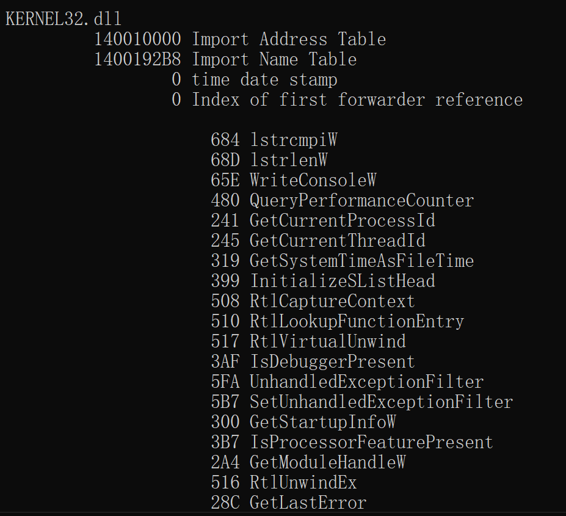
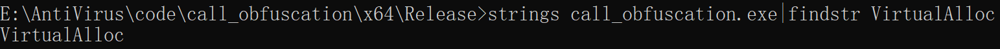
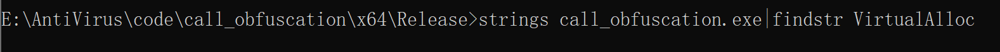
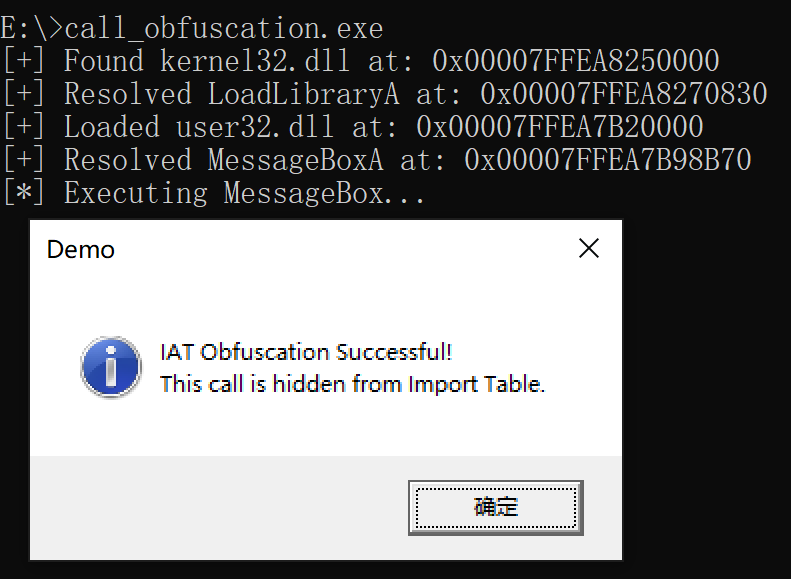
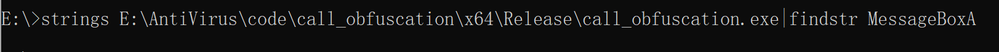

## IAT 隐藏和混淆

导入地址表 (IAT) 包含有关 PE 文件的信息，例如所使用的函数以及导出这些函数的 DLL。此类信息可用于签名和检测二进制文件。


要隐藏 IAT 中的函数，可以使用`GetProcAddress`，`GetModuleHandle`或`LoadLibrary`在运行时动态加载这些函数。

```c++
fnVirtualAllocEx pVirtualAllocEx = GetProcAddress(GetModuleHandleA("KERNEL32.DLL"), "VirtualAllocEx");
```

但是使用此方法存在的问题是，`VirtualAllocEx`字符串仍存在于二进制文件中，可以用来检测函数的使用情况。并且`GetProcAddress`并将`GetModuleHandleA`出现在 IAT 中。

所以我们可以创建执行`GetProcAddress`与`GetModuleHandle` WinAPI 相同操作的自定义函数。这样就可以动态加载函数，而无需让这两个函数出现在 IAT 中。

### 自定义GetProcAddress

先来看一下 `GetProcAddress`的函数功能， `GetProcAddress`从指定的模块句柄中检索导出函数的地址。如果在指定的模块句柄中找不到函数名称，则该函数返回`NULL`。

https://learn.microsoft.com/en-us/windows/win32/api/libloaderapi/nf-libloaderapi-getprocaddress

```c
FARPROC GetProcAddress(
  [in] HMODULE hModule,
  [in] LPCSTR  lpProcName
);
```


#### GetProcAddress 的工作原理


首先我们必须解决的第一点是`GetProcAddress`如何找到并检索函数的地址。

`hModule`参数是已加载 DLL 的基地址。这是 DLL 模块在进程地址空间中的位置。考虑到这一点，检索函数地址的方法是通过循环遍历提供的 DLL 中的导出函数并检查目标函数的名称是否存在。如果存在有效匹配，则检索地址。要访问导出的函数，必须访问 DLL 的导出表并循环遍历它以搜索目标函数名称。


#### MyGetProcAddress的代码实现

```
PVOID MyGetProcAddress(HMODULE handle, LPCSTR Name) {
    PBYTE pBase = (PBYTE)handle;

    // 获取DOS头结构
    PIMAGE_DOS_HEADER pdosHeader = (PIMAGE_DOS_HEADER)pBase;
    if (pdosHeader->e_magic != IMAGE_DOS_SIGNATURE) {
        return NULL;
    }

    // 获取NT头结构（PE头）
    PIMAGE_NT_HEADERS pImageNtHeaders = (PIMAGE_NT_HEADERS)(pBase + pdosHeader->e_lfanew);
    if (pImageNtHeaders->Signature != IMAGE_NT_SIGNATURE) {
        return NULL;
    }

    // 获取可选PE头结构
    IMAGE_OPTIONAL_HEADER peOptionHeader = pImageNtHeaders->OptionalHeader;

    // 从数据目录中获取导出表的虚拟地址
    // IMAGE_DIRECTORY_ENTRY_EXPORT是导出表的索引(第0项)
    PIMAGE_EXPORT_DIRECTORY pExportVirtualAddress = (PIMAGE_EXPORT_DIRECTORY)(pBase + peOptionHeader.DataDirectory[IMAGE_DIRECTORY_ENTRY_EXPORT].VirtualAddress);

    // 获取导出名称表（存储所有导出函数名的地址数组）
    PDWORD FunctionNameArray = (PDWORD)(pBase + pExportVirtualAddress->AddressOfNames);
    // 获取导出地址表（存储所有导出函数的RVA数组）
    PDWORD FunctionAddressArray = (PDWORD)(pBase + pExportVirtualAddress->AddressOfFunctions);
    // 获取导出序数表（名称对应的序数数组）
    PWORD ordinArray = (PWORD)(pBase + pExportVirtualAddress->AddressOfNameOrdinals);

    // 遍历所有导出函数，查找目标函数
    for (DWORD i = 0; i < pExportVirtualAddress->NumberOfFunctions; i++) {
        CHAR* pFunctionName = (CHAR*)(pBase + FunctionNameArray[i]);
        PVOID functionAddress = (PVOID)(pBase + FunctionAddressArray[ordinArray[i]]);

        if (strcmp(Name, pFunctionName) == 0) {
            return functionAddress;
        }
    }
}

```


### 自定义GetModuleHandle

`GetModuleHandleExA`函数检索指定模块的模块句柄。这个函数会返回DLL的句柄，如果不存在相应的DLL，则返回NULL。

https://learn.microsoft.com/en-us/windows/win32/api/libloaderapi/nf-libloaderapi-getmodulehandleexa

```
BOOL GetModuleHandleExA(
  [in]           DWORD   dwFlags,
  [in, optional] LPCSTR  lpModuleName,
  [out]          HMODULE *phModule
);
```

#### GetModuleHandle 的工作原理

首先我们需要理解`GetModuleHandle`如何找到并检索模块的基地址。

`lpModuleName`参数指定要查找的模块名称（如"kernel32.dll"）。该函数的核心工作是通过遍历进程的模块列表来定位目标模块。Windows系统在每个进程中维护了一个已加载模块的链表结构（PEB中的InLoadOrderModuleList），这是模块查询的基础。

考虑到这一点，获取模块句柄的方法是通过线性遍历这个模块链表，并检查每个节点的模块名称是否与目标名称匹配。如果存在有效匹配，则直接返回该模块在内存中的基地址。这个过程完全依赖于对PEB（进程环境块）结构的解析，而不需要像导出表查找那样的复杂结构遍历。

本质上，`GetModuleHandle`的工作可以分为三个步骤：

1. 定位当前进程的PEB结构
2. 通过PEB->Ldr->InLoadOrderModuleList获取模块链表
3. 遍历链表进行名称比对，直到找到目标模块或链表结束

#### MyGetModuleHandle的代码实现

```
HMODULE MyGetModuleHandle(IN LPCWSTR szModuleName) {
    // 获取PEB

#ifdef _WIN64 
    PPEB pPeb = (PEB*)(__readgsqword(0x60));
#elif _WIN32
    PPEB pPeb = (PEB*)(__readfsdword(0x30));
#endif

    // 获取Ldr
    PPEB_LDR_DATA pLdr = (PPEB_LDR_DATA)(pPeb->Ldr);

    // 获取链表头（InMemoryOrderModuleList是循环链表）
    PLDR_DATA_TABLE_ENTRY pDte = (PLDR_DATA_TABLE_ENTRY)(pLdr->InMemoryOrderModuleList.Flink);

    //遍历已加载的模块链表，检查每个模块的路径名是否与目标模块名匹配，匹配成功时返回模块基址，否则继续遍历直到链表结束或模块名无效时终止

    while (pDte) {
        if (pDte->FullDllName.Length != NULL) {
            if (StringEq(pDte->FullDllName.Buffer, szModuleName)) {

#ifdef STRUCTS
                return (HMODULE)(pDte->InMemoryOrderLinks.Flink);
#else
                return (HMODULE)(pDte->Reserved2[0]);
#endif

            }
        }
        else {
            break;
        }
        pDte = *(PLDR_DATA_TABLE_ENTRY*)(pDte);
    }
    return NULL;

}
```

### Demo-VirtualAlloc

在这个Demo中演示了如何在导入表中隐藏VirtualAlloc

函数`VirtualAlloc`是保留、提交或更改指定进程的虚拟地址空间中内存区域的状态。该函数将它分配的内存初始化为零。

https://learn.microsoft.com/en-us/windows/win32/api/memoryapi/nf-memoryapi-virtualalloc

```
LPVOID VirtualAlloc(
  [in, optional] LPVOID lpAddress,
  [in]           SIZE_T dwSize,
  [in]           DWORD  flAllocationType,
  [in]           DWORD  flProtect
);
```

重新自定义了一个 函数指针类型 `pfnVirtualAlloc`，它用于指向 `VirtualAlloc`这个 Windows API 函数。

```
typedef LPVOID(WINAPI* pfnVirtualAlloc)(
	_In_opt_ LPVOID lpAddress,
	_In_ SIZE_T dwSize,
	_In_ DWORD flAllocationType,
	_In_ DWORD flProtect
);
```

- 调用自定义的 `MyGetModuleHandle` 函数，动态获取 `kernel32.dll` 的 模块基址（HMODULE）。
- 调用自定义的 `MyGetProcAddress` 函数，从 `kernel32.dll` 中查找 `VirtualAlloc` 的函数地址。
- 动态获取 `VirtualAlloc` 函数的地址，并存储到函数指针 `fnVirtualAlloc` 中

```
	pfnVirtualAlloc fnVirtualAlloc = (pfnVirtualAlloc)MyGetProcAddress(MyGetModuleHandle(L"kernel32.dll"), "VirtualAlloc");
```

最后重新查看IMPORT表，成功隐藏了VirtualAlloc函数




### Xor混淆字符串

在函数调用混淆之后，如果 AV 引擎从二进制文件中提取所有字符串，`VirtualAlloc` 仍然很容易被识别



原因是使用了明文字符串，可以使用 XOR 函数来混淆这一点。

首先定义一个XOR函数，对VirtualAlloc进行异或加密并得到加密后的字符串

```
void XOR(char* data, size_t data_len, char* key, size_t key_len) {
	int j;
	j = 0;
	for (int i = 0; i < data_len; i++) {
		if (j == key_len - 1) j = 0;
		data[i] = data[i] ^ key[j];
		j++;
	}
}
```

然后，在主函数中加入XOR密钥和加密后的VirtualAlloc

```
char key_xor[] ="ABCDEFGHIJKLMNOPORSTUVWXYZ"; 
char sVirtualAlloc[] = { 0x17, 0x2b, 0x31, 0x30, 0x30, 0x27, 0x2b, 0x09, 0x25, 0x26, 0x24, 0x2f };
```

最后，在调用前解密sVirtualAlloc，并且调用fnVirtualAlloc时使用sVirtualAlloc

```
XOR((char*)sVirtualAlloc, strlen(sVirtualAlloc), key_xor, sizeof(key_xor));
pfnVirtualAlloc fnVirtualAlloc = (pfnVirtualAlloc)MyGetProcAddress(MyGetModuleHandle(L"kernel32.dll"), sVirtualAlloc);
```

成功隐藏了VirtualAlloc字符串




### Demo-MessageBox

在此Demo中演示了如何在导入表中隐藏LoadLibraryA与MessageBox的调用。

与上个Demo不同在于，MessageBox存在user32.dll中，而user32.dll通常不在内存中。所以此处需要先使用**LoadLibraryA**来把user32.dll加载进入内存，再混淆。

#### IAT 混淆流程

1. **Kernel32.dll**：因为它一定在内存里，所以直接用 MyGetModuleHandle 获取基址。

   > **Kernel32.dll / Ntdll.dll**：
   > 这是 Windows 程序运行的基础。任何 EXE 启动时，操作系统加载器（OS Loader）都会**强制**先把这两个 DLL 加载进内存。所以程序一启动，它们就已经在 PEB 链表里了。所以可以直接用 MyGetModuleHandle 找到它们。

2. **LoadLibraryA**：它在 Kernel32 里，所以用 MyGetProcAddress 从 Kernel32 找到它。

3. **User32.dll**：它通常不在内存里，所以**必须**用刚才找到的 LoadLibraryA 去加载它。

4. **MessageBoxA**：它在 User32 里，现在 User32 加载了，可以用 MyGetProcAddress 找到它。


#### 实现代码

头文件UserDefineApi.h中包含上述自定义的MyGetProcAddress和MyGetModuleHandle，这段代码实现了在运行时动态获取 kernel32.dll 和 user32.dll 的地址，然后手动查找函数地址并调用。这样，PE 文件的导入表中就不会出现 MessageBoxA 或 LoadLibrary。

```
#include <iostream>
#include "UserDefineApi.h" // 包含提供的头文件

// 定义函数指针类型。我们需要知道目标函数的参数和返回值类型，以便正确调用

// LoadLibraryA 用于加载 user32.dll
typedef HMODULE(WINAPI* P_LoadLibraryA)(LPCSTR lpLibFileName);

// MessageBoxA 用于弹窗
typedef int (WINAPI* P_MessageBoxA)(HWND hWnd, LPCSTR lpText, LPCSTR lpCaption, UINT uType);


int main() {

    // 获取 Kernel32.dll 基址。Kernel32 是所有 Windows 程序默认加载的，我们可以直接在 PEB 里找到它
    HMODULE hKernel32 = MyGetModuleHandle(L"kernel32.dll");
    if (hKernel32 == NULL) {
        printf("[-] Failed to find kernel32.dll in PEB\n");
        return -1;
    }
    printf("[+] Found kernel32.dll at: 0x%p\n", hKernel32);

    // 手动解析 LoadLibraryA。我们需要它来加载 user32.dll (因为 user32 默认可能未加载)
    // 注意：这里传入了字符串 "LoadLibraryA"，它会存在于二进制文件中，但不在 IAT 中
    P_LoadLibraryA MyLoadLibrary = (P_LoadLibraryA)MyGetProcAddress(hKernel32, "LoadLibraryA");
    if (MyLoadLibrary == NULL) {
        printf("[-] Failed to resolve LoadLibraryA\n");
        return -1;
    }
    printf("[+] Resolved LoadLibraryA at: 0x%p\n", MyLoadLibrary);

    // 加载 User32.dll
    HMODULE hUser32 = MyLoadLibrary("user32.dll");
    if (hUser32 == NULL) {
        printf("[-] Failed to load user32.dll\n");
        return -1;
    }
    printf("[+] Loaded user32.dll at: 0x%p\n", hUser32);

    // 手动解析 MessageBoxA
    P_MessageBoxA MyMessageBox = (P_MessageBoxA)MyGetProcAddress(hUser32, "MessageBoxA");
    if (MyMessageBox == NULL) {
        printf("[-] Failed to resolve MessageBoxA\n");
        return -1;
    }
    printf("[+] Resolved MessageBoxA at: 0x%p\n", MyMessageBox);

    //调用函数.此时杀软监控 IAT 是看不到我们在调 MessageBox 的
    printf("[*] Executing MessageBox...\n");
    MyMessageBox(NULL, "IAT Obfuscation Successful!\nThis call is hidden from Import Table.", "Demo", MB_OK | MB_ICONINFORMATION);


    return 0;
}
```




### API Hash

除了通过xor来隐藏字符串，还可以使用API Hash的方法使代码里不出现函数名的字符串。

#### 区别

在GetProcAddress函数中不再采用传入的字符串（比如 "MessageBoxA"）去和导出表里的名字逐字比对。

```
if (strcmp(Name, pFunctionName) == 0) {
            return functionAddress;
        }
```

修改为计算导出表里的函数名为一个哈希值，然后再去与导出表的所有函数的哈希值进行比较

```
if (dwApiNameHash == HASHA(pFunctionName)) {
			return pFunctionAddress;
		}
```


#### Compile Time API Hashing

 **constexpr**（常量表达式）会让编译器在编译的时候就把这行代码算出来，不等到程序运行的时候再算

```
constexpr DWORD HASH = HashStringDjb2W(L"kernel32.dll");
// 编译器在后台默默做了这件事：
// 1. 发现 HashStringDjb2W 是 constexpr
// 2. 发现参数是常量字符串
// 3. 执行计算：Hash("kernel32.dll") = 1843156837
// 4. 替换代码
```

最终编译后的EXE 文件里只有 0x1843156837 这个数字，没有 "kernel32.dll" 这个字符串。

#### 生成随机种子值

在编译时 API 哈希中，每次二进制文件编译时都会生成动态哈希值。

`RandomCompileTimeSeed` 用于根据当前时间生成随机种子值。它通过从 [**TIME**](https://www.cprogramming.com/reference/preprocessor/__TIME__.html#:~:text=__TIME__ is a,moment a binary was built.&text=You can also use the,to get the current date.) 宏中提取数字来实现这一点，TIME 宏是 C++中预定义的宏，可以以 `HH：MM：SS` 格式展开为当前时间。然后，`RandomCompileTimeSeed` 函数将每个数字乘以不同的随机常数，并全部相加生成最终的种子值。

利用 __TIME__ 宏，让每次编译生成的 g_KEY 都不一样

```
constexpr int RandomCompileTimeSeed(void)
{
    return '0' * -40271 +
        __TIME__[7] * 1 +
        __TIME__[6] * 10 +
        __TIME__[4] * 60 +
        __TIME__[3] * 600 +
        __TIME__[1] * 3600 +
        __TIME__[0] * 36000;
};

// 全局编译时随机密钥
constexpr auto g_KEY = RandomCompileTimeSeed() % 0xFF;
```

#### api_hash.h

集成了修改后的MyGetModuleHandleH和MyGetProcAddressH，以及RandomCompileTimeSeed

```
#pragma once
#include <iostream>
#include <Windows.h>
#include <winternl.h>

// 编译时随机种子生成器 
constexpr int RandomCompileTimeSeed(void)
{
    return '0' * -40271 +
        __TIME__[7] * 1 +
        __TIME__[6] * 10 +
        __TIME__[4] * 60 +
        __TIME__[3] * 600 +
        __TIME__[1] * 3600 +
        __TIME__[0] * 36000;
};

// 全局编译时随机密钥
constexpr auto g_KEY = RandomCompileTimeSeed() % 0xFF;


// 字符串哈希 (ASCII)
constexpr DWORD HashStringDjb2A(const char* String) {
    ULONG Hash = (ULONG)g_KEY; // 使用随机种子初始化
    INT c = 0;
    while ((c = *String++)) {
        Hash = ((Hash << 5) + Hash) + c;
    }
    return Hash;
}

// 字符串哈希 (WideChar)
constexpr DWORD HashStringDjb2W(const wchar_t* String) {
    ULONG Hash = (ULONG)g_KEY; // 使用随机种子初始化
    INT c = 0;
    while ((c = *String++)) {
        if (c >= 'A' && c <= 'Z') c += 32;
        Hash = ((Hash << 5) + Hash) + c;
    }
    return Hash;
}

HMODULE MyGetModuleHandleH(DWORD dwDllHash) {
#ifdef _WIN64 
    PPEB pPeb = (PEB*)(__readgsqword(0x60));
#elif _WIN32
    PPEB pPeb = (PEB*)(__readfsdword(0x30));
#endif

    PPEB_LDR_DATA pLdr = (PPEB_LDR_DATA)(pPeb->Ldr);
    PLDR_DATA_TABLE_ENTRY pDte = (PLDR_DATA_TABLE_ENTRY)(pLdr->InMemoryOrderModuleList.Flink);

    while (pDte) {
        if (pDte->FullDllName.Length != NULL) {
            // 使用 HashStringDjb2W 计算当前 DLL 名的哈希并对比
            if (HashStringDjb2W(pDte->FullDllName.Buffer) == dwDllHash) {
#ifdef STRUCTS
                return (HMODULE)(pDte->InMemoryOrderLinks.Flink);
#else
                return (HMODULE)(pDte->Reserved2[0]);
#endif
            }
        }
        else {
            break;
        }
        pDte = *(PLDR_DATA_TABLE_ENTRY*)(pDte);
    }
    return NULL;
}

PVOID MyGetProcAddressH(HMODULE handle, DWORD dwApiHash) {
    if (handle == NULL) return NULL;

    PBYTE pBase = (PBYTE)handle;

    PIMAGE_DOS_HEADER pdosHeader = (PIMAGE_DOS_HEADER)pBase;
    if (pdosHeader->e_magic != IMAGE_DOS_SIGNATURE) return NULL;

    PIMAGE_NT_HEADERS pImageNtHeaders = (PIMAGE_NT_HEADERS)(pBase + pdosHeader->e_lfanew);
    if (pImageNtHeaders->Signature != IMAGE_NT_SIGNATURE) return NULL;

    IMAGE_OPTIONAL_HEADER peOptionHeader = pImageNtHeaders->OptionalHeader;

    if (peOptionHeader.DataDirectory[IMAGE_DIRECTORY_ENTRY_EXPORT].VirtualAddress == 0) return NULL;

    PIMAGE_EXPORT_DIRECTORY pExportVirtualAddress = (PIMAGE_EXPORT_DIRECTORY)(pBase + peOptionHeader.DataDirectory[IMAGE_DIRECTORY_ENTRY_EXPORT].VirtualAddress);

    PDWORD FunctionNameArray = (PDWORD)(pBase + pExportVirtualAddress->AddressOfNames);
    PDWORD FunctionAddressArray = (PDWORD)(pBase + pExportVirtualAddress->AddressOfFunctions);
    PWORD ordinArray = (PWORD)(pBase + pExportVirtualAddress->AddressOfNameOrdinals);

    for (DWORD i = 0; i < pExportVirtualAddress->NumberOfNames; i++) {
        CHAR* pFunctionName = (CHAR*)(pBase + FunctionNameArray[i]);

        // 使用 HashStringDjb2A 计算当前函数名的哈希并对比
        if (HashStringDjb2A(pFunctionName) == dwApiHash) {
            return (PVOID)(pBase + FunctionAddressArray[ordinArray[i]]);
        }
    }
    return NULL;
}

//  辅助宏 
#define CTIME_HASHA( STR ) HashStringDjb2A( STR )
#define CTIME_HASHW( STR ) HashStringDjb2W( STR )
```


#### Demo

这个Demo使用 `GetModuleHandleH` 和 `GetProcAddressH` 来调用`LoadLibrary` 和`MessageBoxA`。

从而EXE 的导入表（IAT）里既没有 MessageBox，也没有 LoadLibrary，实现IAT Obfuscation。

```
#include <iostream>
#include "api_hash.h" // 包含上面的头文件

// 1. 定义函数指针
typedef HMODULE(WINAPI* P_LoadLibraryA)(LPCSTR);
typedef int (WINAPI* P_MessageBoxA)(HWND, LPCSTR, LPCSTR, UINT);

int main() {
    // 编译时计算哈希
    constexpr DWORD HASH_KERNEL32 = HashStringDjb2W(L"kernel32.dll");
    constexpr DWORD HASH_LOADLIB = HashStringDjb2A("LoadLibraryA");
    constexpr DWORD HASH_MSGBOX = HashStringDjb2A("MessageBoxA");

    // 1. 获取 Kernel32 基址 (传入哈希)
    HMODULE hKernel32 = MyGetModuleHandleH(HASH_KERNEL32);
    if (!hKernel32) return -1;

    // 2. 获取 LoadLibraryA 地址 (传入哈希)
    P_LoadLibraryA MyLoadLibrary = (P_LoadLibraryA)MyGetProcAddressH(hKernel32, HASH_LOADLIB);
    if (!MyLoadLibrary) return -1;

    // 3. 加载 User32.dll
    HMODULE hUser32 = MyLoadLibrary("user32.dll");
    if (!hUser32) return -1;

    // 4. 获取 MessageBoxA 地址 (传入哈希)
    P_MessageBoxA MyMessageBox = (P_MessageBoxA)MyGetProcAddressH(hUser32, HASH_MSGBOX);
    if (!MyMessageBox) return -1;

    // 5. 调用
    MyMessageBox(0, "API Hashing Works!", "Success", 0);

    return 0;
}
```

exe中不会包含相关的字符串信息



